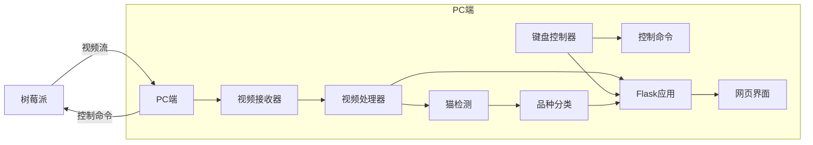

# 猫咪迷宫控制系统

这个项目是一个智能猫咪迷宫控制系统，结合了实时视频流处理、猫品种识别和远程控制功能，为猫咪提供智能互动体验。

## 功能概述

- 🎥 实时视频流处理与显示
- 🐱 猫检测与品种识别（5种猫品种）
- 🕹️ 键盘远程控制迷宫
- 📊 实时状态显示（按键状态、猫品种信息）
- 📸 自动捕获猫咪图像并分类保存

## 项目结构

```bash
APP/
├── captured_cats/          # 保存捕获的猫图片
├── model/                  # 模型目录
│   └── mix_dataset_model.h5  # 猫品种分类模型
├── static/                 # 静态文件
│   └── style.css           # 样式表
├── templates/              # 模板
│   └── index.html          # 主页面
├── __pycache__/            # 编译的Python文件
├── app.py                  # Flask主应用
├── camera_receiver.py      # 接收树莓派视频流
├── keyboard_controller.py  # 键盘控制程序
├── shared_state.py         # 共享状态管理
├── video_classification.py # 视频处理和分类
└── yolov8n.pt              # YOLOv8模型（目标检测）
```

## 安装与运行

### 前提条件

- Python 3.8+
- 树莓派（运行视频流和控制服务器）
- 支持CUDA的GPU（可选，用于加速推理）

### 安装步骤

1. 克隆仓库：
   ```bash
   git clone https://github.com/yourusername/cat-maze-control.git
   cd cat-maze-control
   ```

2. 创建虚拟环境并激活：
   ```bash
   python -m venv venv
   source venv/bin/activate  # Linux/macOS
   venv\Scripts\activate     # Windows
   ```

3. 安装依赖：
   ```bash
   pip install -r requirements.txt
   ```

4. 下载模型文件：
   - YOLOv8模型：[yolov8n.pt](https://github.com/ultralytics/assets/releases/download/v0.0.0/yolov8n.pt)
   - 猫品种分类模型：[mix_dataset_model.h5](https://example.com/path/to/model.h5)（需自行训练或获取）

5. 将模型文件放入对应目录：
   - `yolov8n.pt` 放在项目根目录
   - `mix_dataset_model.h5` 放在 `model/` 目录

### 运行系统

1. **启动主应用**：
   ```bash
   python app.py
   ```

2. **启动键盘控制器**（新终端窗口）：
   ```bash
   python keyboard_controller.py
   ```

3. 访问网页界面：`http://localhost:5000`

## 使用说明

### 键盘控制

| 按键 | 功能 |
|------|------|
| W    | 前进 |
| A    | 左转 |
| S    | 后退 |
| D    | 右转 |
| Q    | 斜左前 |
| E    | 斜右前 |
| ↑    | 加速 |
| ↓    | 减速 |
| 1/2/3 | 速度挡位 |
| ←    | 舵机左转 |
| →    | 舵机右转 |
| 空格 | 舵机停止 |
| 0    | 舵机复位 |
| C/V/B/N/M | 显示猫品种 |
| ESC  | 退出程序 |

### 网页界面

- 左侧显示实时视频流
- 右侧显示当前按键状态
- 猫品种识别结果和置信度

## 系统架构



## 技术栈

- **计算机视觉**：
  - YOLOv8（实时目标检测）
  - EfficientNetB3（猫品种分类）
  - OpenCV（图像处理）

- **后端**：
  - Flask（Web框架）
  - ZeroMQ（视频流传输）
  - TensorFlow/Keras（深度学习）

- **前端**：
  - HTML/CSS/JavaScript
  - jQuery（AJAX请求）

- **网络通信**：
  - UDP（控制命令传输）
  - HTTP（网页服务）

## 配置说明

### 树莓派设置

1. 安装必要的依赖：
   ```bash
   sudo apt-get install libopencv-dev python3-opencv
   pip install pyzmq opencv-python
   ```

2. 运行视频发送脚本（示例）：
   ```python
   import cv2
   import zmq
   import base64
   import numpy as np
   
   context = zmq.Context()
   footage_socket = context.socket(zmq.PAIR)
   footage_socket.connect('tcp://<PC_IP>:5555')  # 替换为PC的IP地址
   
   cap = cv2.VideoCapture(0)
   
   while True:
       ret, frame = cap.read()
       if not ret:
           continue
       
       # 调整分辨率
       frame = cv2.resize(frame, (640, 480))
       
       # 编码并发送
       _, buffer = cv2.imencode('.jpg', frame)
       jpg_as_text = base64.b64encode(buffer)
       footage_socket.send(jpg_as_text)
   ```

### 模型训练

如需训练自己的猫品种分类模型：

1. 准备数据集（按品种分类的猫咪图片）
2. 使用EfficientNetB3作为基础模型
3. 进行迁移学习：
   ```python
   base_model = EfficientNetB3(weights='imagenet', include_top=False, input_shape=(300, 300, 3))
   x = base_model.output
   x = GlobalAveragePooling2D()(x)
   x = Dense(512, activation='relu')(x)
   predictions = Dense(5, activation='softmax')(x)  # 5个品种
   model = Model(inputs=base_model.input, outputs=predictions)
   ```

## 常见问题解决

**Q: 视频流无法显示**
- 检查树莓派和PC之间的网络连接
- 确认树莓派视频发送脚本正在运行
- 检查防火墙设置，确保5555端口开放

**Q: 键盘控制无响应**
- 确保`keyboard_controller.py`正在运行
- 检查树莓派控制服务器是否启动
- 验证UDP端口26669是否开放

**Q: 猫品种识别不准确**
- 尝试调整`video_classification.py`中的置信度阈值
- 确保模型文件路径正确
- 考虑使用更多样化的训练数据重新训练模型

## 未来改进方向

1. 添加多猫追踪功能
2. 实现自动迷宫路径规划
3. 增加猫咪行为分析模块
4. 开发移动端控制应用
5. 添加云端存储和分享功能

## 贡献指南

欢迎贡献！请遵循以下步骤：
1. Fork仓库
2. 创建新分支 (`git checkout -b feature/your-feature`)
3. 提交更改 (`git commit -m 'Add some feature'`)
4. 推送到分支 (`git push origin feature/your-feature`)
5. 创建Pull Request

## 许可证

本项目采用 [MIT 许可证](LICENSE)。